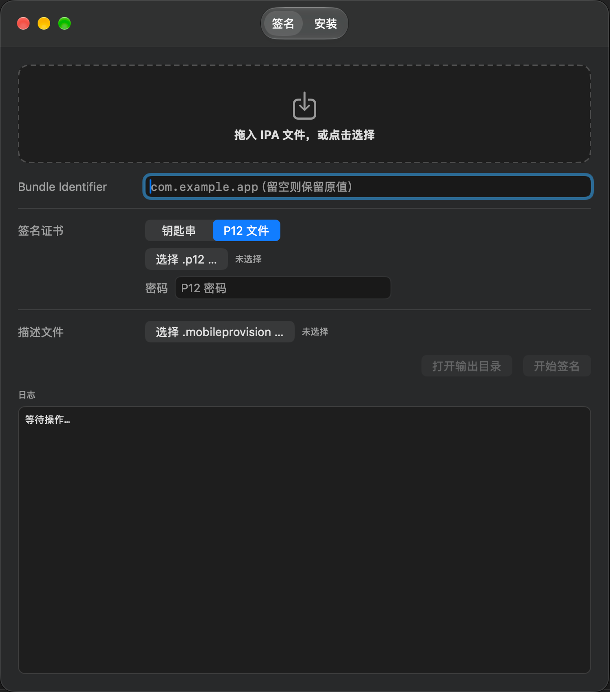
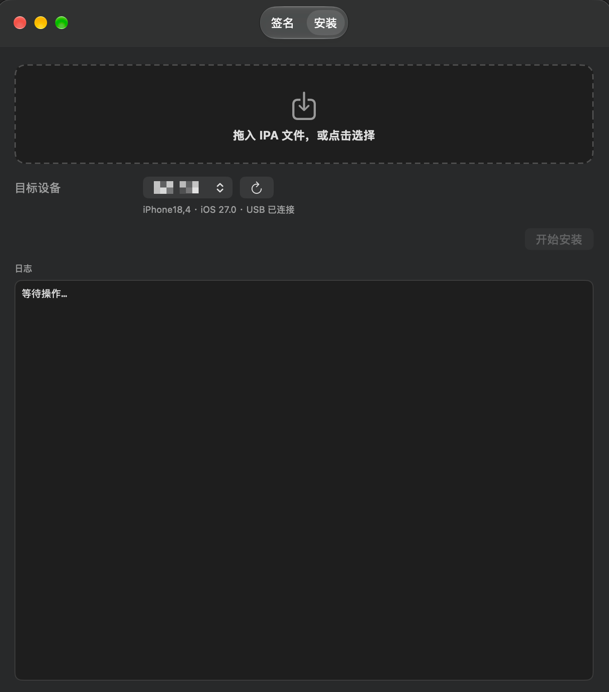

# eSign

一个 macOS 上的 IPA 重签名与安装工具。拖入 IPA，选好证书和描述文件，点一下就能拿到重签好的包；也可以直接把包装进数据线连着的 iPhone。

## 功能

### 签名

- **拖拽或点选 IPA**，不需要先把 IPA 解压好
- **改写 Bundle Identifier**（可选）。留空则保留原值；填写后会同步改写嵌套扩展的 Bundle ID 前缀，例如 `com.foo.app.ext` 跟着 `com.foo.app` → `com.bar.app` 变成 `com.bar.app.ext`
- **两种证书来源**
  - 钥匙串：列出 `security find-identity -p codesigning` 里所有可用证书，下拉选择
  - P12 文件：输入密码即可，程序会建一个临时钥匙串导入证书、签完自动删除，不污染系统钥匙串
- **描述文件解析**：选中 `.mobileprovision` 后直接显示名称、团队、App ID 和到期时间，过期会给出警告
- **由内到外逐层签名**：dylib → framework → appex → 主应用，按层级深度排序，避免签名顺序错误导致校验失败
- **输出**：在输入 IPA 的同目录生成 `{原文件名}_signed.ipa`

### 安装

- **拖拽或点选 IPA**
- **自动扫描已连接的 iOS 设备**，多台可选，显示型号、系统版本和连接方式（USB / 网络）
- 手表、电视、头显等装不了 IPA 的平台会自动从列表里过滤掉
- 通过 `xcrun devicectl` 安装，日志实时滚动输出
- 设备未连接时会明确提示

## 截图

### 签名



### 安装



## 环境要求

- **macOS 27.0 或更高**（项目的部署目标）
- **完整安装的 Xcode**。安装功能依赖 `xcrun devicectl`，这个命令不包含在 Command Line Tools 里，必须装完整版 Xcode 并用 `xcode-select` 指向它：

  ```sh
  sudo xcode-select -s /Applications/Xcode.app/Contents/Developer
  ```

  验证：

  ```sh
  xcrun --find devicectl
  ```

- 一个可用于代码签名的证书（企业证书或个人开发者证书，装在钥匙串里或以 `.p12` 形式持有）
- 与证书匹配的 `.mobileprovision` 描述文件
- 安装到真机时，设备需用数据线连接并在设备上点「信任本机」

## 构建

```sh
git clone <repo-url>
cd esign
open esign.xcodeproj
```

在 Xcode 里直接运行，或者走命令行：

```sh
xcodebuild -project esign.xcodeproj -scheme esign -configuration Release build
```

产物在 `~/Library/Developer/Xcode/DerivedData/esign-*/Build/Products/Release/esign.app`。

## 使用

### 重签名

1. 切到「签名」标签页，把 IPA 拖进顶部区域
2. （可选）填写新的 Bundle Identifier，留空表示不改
3. 选择签名证书：钥匙串里已有就选「钥匙串」，只有 `.p12` 文件就选「P12 文件」并输入密码
4. 选择 `.mobileprovision` 文件，确认下方显示的 App ID 和有效期没问题
5. 点「开始签名」，日志面板会输出每一步的进度
6. 完成后点「打开输出目录」，`{原文件名}_signed.ipa` 就在原 IPA 旁边

> 填写的 Bundle Identifier 必须和描述文件的 App ID 对得上（除非用的是通配符描述文件），否则签出来的包装不上机器。程序检测到不一致时会在日志里给出警告，但不会阻止你继续。

### 安装

1. 切到「安装」标签页，把 IPA 拖进顶部区域
2. 用数据线连上 iPhone，在设备列表里选中它
3. 点「开始安装」，日志会实时滚动 devicectl 的输出

> 安装功能只负责把包送进设备，不做签名。装一个未签名或签名不匹配的 IPA 会被系统拒绝。

## 实现说明

### 为什么关掉了 App Sandbox

项目里 `ENABLE_APP_SANDBOX = NO`，这是有意为之。开启沙箱后，子进程会继承沙箱限制，导致 `codesign` 无法读取证书私钥、`security` 无法访问钥匙串，签名功能直接不可用。**不要改回 `YES`。**

### 临时钥匙串

用 P12 签名时，程序会临时执行：

```
security create-keychain → import -P → set-key-partition-list → 签名 → delete-keychain
```

`set-key-partition-list` 这一步是为了让 `codesign` 访问私钥时不再弹密码框。整个过程在临时目录里完成，签名结束后无论成功失败都会删掉临时钥匙串。

### 未通过信任校验的证书

有些 P12 里没带完整的中间证书，`security find-identity -v` 会把它过滤掉。程序会自动退回到不过滤的查询，并在日志里提示「证书链未通过系统信任校验，仍尝试使用」——这种情况下签名通常仍能成功。

### 中文字符变成问号

从访达启动的 GUI 程序不继承终端的 locale 环境变量，子进程会退回 ASCII，把 `devicectl` 输出里的 `•` 之类字符显示成 `?`。派生子进程时统一补了 `LC_ALL=en_US.UTF-8` 来避免这个问题。

## 项目结构

| 文件 | 职责 |
| --- | --- |
| `esign/ContentView.swift` | 根视图，两个标签页的容器 |
| `esign/SigningView.swift` | 签名页界面 |
| `esign/InstallView.swift` | 安装页界面 |
| `esign/SignerViewModel.swift` | 签名页的状态与流程编排 |
| `esign/InstallViewModel.swift` | 安装页的状态与流程编排 |
| `esign/IPASigner.swift` | 签名引擎：证书解析、描述文件处理、逐层签名 |
| `esign/IPAArchive.swift` | IPA 解压与重新打包 |
| `esign/DeviceInstaller.swift` | 设备枚举与 devicectl 安装 |
| `esign/Shell.swift` | 子进程封装，支持一次性执行和按行流式回调 |
| `esign/Components.swift` | 拖拽区、日志面板等通用组件 |
| `tools/make-icon.swift` | AppIcon 生成脚本，改配色/字体后重新运行即可 |

## 图标

图标是脚本生成的，不是手绘位图。改 `tools/make-icon.swift` 顶部的常量（渐变色、字重、字距、文字占比）后重新运行：

```sh
swift tools/make-icon.swift
```

会覆盖 `esign/Assets.xcassets/AppIcon.appiconset/` 下的 10 张 PNG。16/32px 用的是单独渲染的简化版（去掉投影、文字放大），因为带投影的缩略图在小尺寸下会糊成一团。
